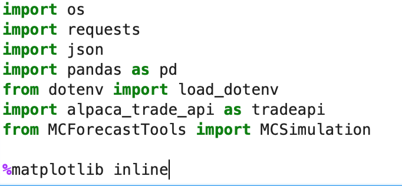
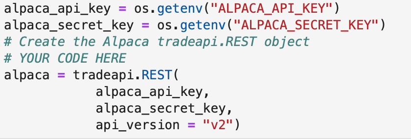
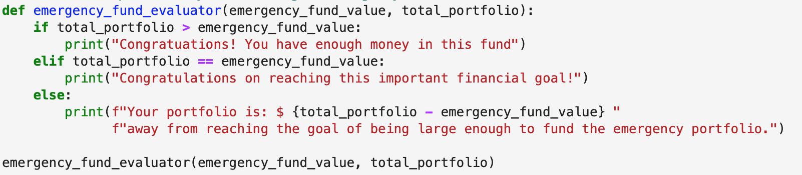
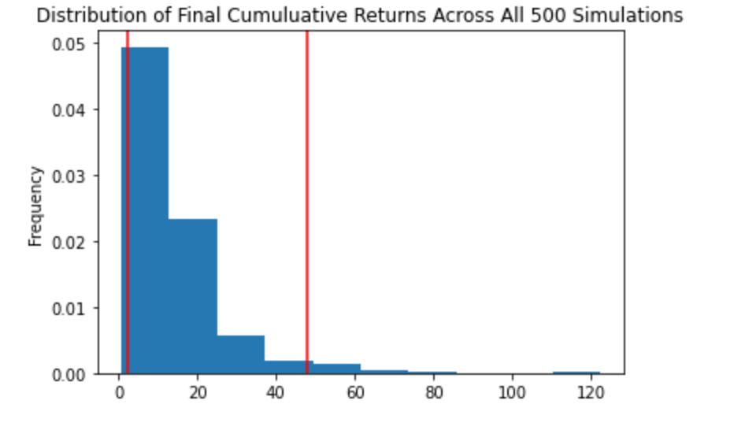
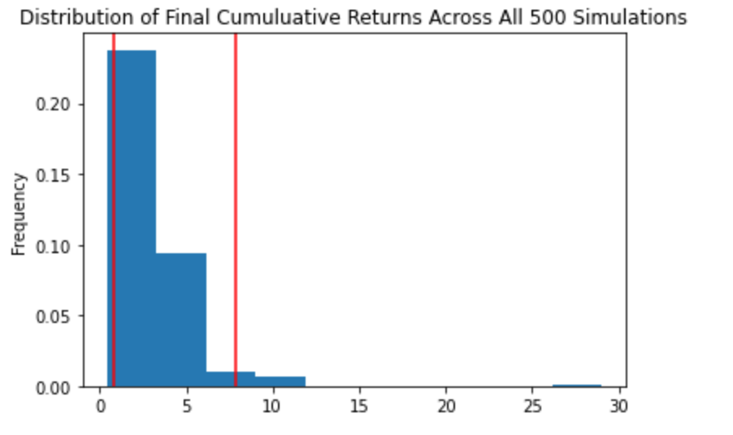

# Financial Planners
This project entails building a tool to help credit union members evaluate their financial health. It helps them  to assess their monthly budgets and forecast a reasonably effective retirement plan based on their current holdings of cryptocurrencies, stocks, and bonds. 

This notebook contains:
* A financial planner for emergencies. The members will be able to use this tool to visualize their current savings. The members can then determine if they have enough reserves for an emergency fund.

* A financial planner for retirement. This tool will forecast the performance of their retirement portfolio in 30 years. To do this, the tool will make an Alpaca API call via the Alpaca SDK to get historical price data for use in Monte Carlo simulations.

## Dataset
A collection of the current prices for the Bitcoin and Ethereum cryptocurrencies by using the Python Requests library from api.alternative.me using the following url:

```python
btc_url = "https://api.alternative.me/v2/ticker/Bitcoin/?convert=USD"
eth_url = "https://api.alternative.me/v2/ticker/Ethereum/?convert=USD"
```

A data for a Monte Carlo Simulations has been collected via API call to Alpaca via the Alpaca SDK to get 3 years of closing prices of the SPDR S&P 500 ETF Trust (ticker: SPY) and of the iShares Core US Aggregate Bond ETF (ticker: AGG)

## Technologies 
This project leverages python 3.7 with the following packages:
* Pandas - for financial calculations
* Path - for identifying the file
* Matplotlib - for creation of visual graphs
* os- provides functions for interacting with the computer's operating system.
* requests - for making API calls
* json - for reading the JSON object returned by the API server
* dotenv - for protection of API keys
* alpaca_trade_api - software development kit needed for interaction with ALPACA API
*  MCForecastTools - for Monte Carlo simulations

## Installation guide 
Thsi project leverages python 3.7 with the following dependencies:

``` python

pip install python-dotenv
conda install -c anaconda requests
conda install -c jmcmurray json
pip install alpaca-trade-api
pip install matplotlib
```
--- 
Import required libraries and dependencies:




---
In  order to run the application you need to set up an Alpaca Markets account and obtain your perosnal API keys. You use these unique identifiers to establish an authenticated, secure connection to an API. 
For the security reasons you should store your unique API keys in a hidden file called .env
This file protects the content of the file by hiding it in the structure of the project. To display hidden files in Jupyterlab run the following command in your terminal:

``` python
jupyter lab --ContentsManager.allow_hidden=True
```


The project accesses the Alpaca API keys from the environment variables, and stores it in a Python variables named alpaca_api_key and alpaca_secret_api_key.




## Usage

Emergency Fund Calculator



---

Monte Carlo Simulation 30 year cumulative return (60% SPY, 40% AGG):



---

Monte Carlo Simulation 10 year cumulative return (80% SPY, 20% AGG): 




## Contributors
Brought to you by Ksenia Gorska as part of the UC Berkeley Extension Bootcamp: UCB-VIRT-FIN-PT-06-2021-U-B-MW Ksenia Gorska
 e-mail: kseniagorska@icloud.com 
[linkedin] (https://www.linkedin.com/in/ksenia-gorska/)

## License

MIT
